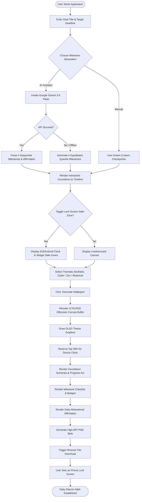

# Activity Diagram — Countdown Creation & Wallpaper Export

```mermaid
flowchart TD
    Start([User Starts Application]) --> Input[Enter Goal Title & Target Deadline]
    Input --> ModeChoice{Choose Milestone Generation}
    
    ModeChoice -->|AI-Assisted| GeminiCall[Invoke Google Gemini 3.8 Flash]
    ModeChoice -->|Manual| ManualInput[User Enters Custom Checkpoints]
    
    GeminiCall --> CheckAPI{API Success?}
    CheckAPI -->|Yes| ParseAI[Parse 4 Sequential Milestones & Affirmation]
    CheckAPI -->|No / Offline| Heuristic[Generate 4 Equidistant Quartile Milestones]
    
    ParseAI --> RenderPreview[Render Interactive Countdown & Timeline]
    Heuristic --> RenderPreview
    ManualInput --> RenderPreview
    
    RenderPreview --> ToggleOverlay{Toggle Lock Screen Safe-Zone?}
    ToggleOverlay -->|Yes| ShowOverlay[Display iOS/Android Clock & Widget Safe-Zones]
    ToggleOverlay -->|No| NormalPreview[Display Unobstructed Canvas]
    
    ShowOverlay --> SelectTheme[Select Thematic Aesthetic: Cyber / Zen / Botanical]
    NormalPreview --> SelectTheme
    
    SelectTheme --> ExportAction[Click 'Generate Wallpaper']
    ExportAction --> AllocBuffer[Allocate 1170x2532 Offscreen Canvas Buffer]
    AllocBuffer --> DrawBackground[Draw OLED Theme Gradient]
    DrawBackground --> DrawSafeZone[Reserve Top 28% for Device Clock]
    DrawSafeZone --> DrawTimer[Render Countdown Numerals & Progress Arc]
    DrawTimer --> DrawMilestones[Render Milestone Checklist & Badges]
    DrawMilestones --> DrawAffirmation[Render Daily Motivational Affirmation]
    DrawAffirmation --> ExportBlob[Generate High-DPI PNG Blob]
    ExportBlob --> TriggerDownload[Trigger Browser File Download]
    TriggerDownload --> SetPhone[User Sets as Phone Lock Screen]
    SetPhone --> End([Daily Glance Habit Established])
```
