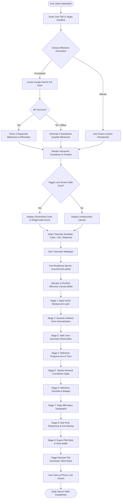

# Activity Diagram — Countdown Creation & 9-Stage Wallpaper Export

```mermaid
flowchart TD
    Start([User Starts Application]) --> Input[Enter Goal Title & Target Deadline]
    Input --> ModeChoice{Choose Milestone Generation}
    
    ModeChoice -->|AI-Assisted| GeminiCall[Invoke Google Gemini 3.8 Flash]
    ModeChoice -->|Manual| ManualInput[User Enters Custom Checkpoints]
    
    GeminiCall --> CheckAPI{API Success?}
    CheckAPI -->|Yes| ParseAI[Parse 4 Sequential Milestones & Affirmation]
    CheckAPI -->|No / Offline| Heuristic[Generate 4 Equidistant Quartile Milestones]
    
    ParseAI --> RenderPreview[Render Interactive Countdown & Timeline]
    Heuristic --> RenderPreview
    ManualInput --> RenderPreview
    
    RenderPreview --> ToggleOverlay{Toggle Lock Screen Safe-Zone?}
    ToggleOverlay -->|Yes| ShowOverlay[Display iOS/Android Clock & Widget Safe-Zones]
    ToggleOverlay -->|No| NormalPreview[Display Unobstructed Canvas]
    
    ShowOverlay --> SelectTheme[Select Thematic Aesthetic: Cyber / Zen / Botanical]
    NormalPreview --> SelectTheme
    
    SelectTheme --> ExportAction[Click 'Generate Wallpaper']
    ExportAction --> FontGate[Font Readiness Barrier: ensureFontsLoaded]
    FontGate --> AllocBuffer[Allocate 1170x2532 Offscreen Canvas Buffer]
    AllocBuffer --> Stage1[Stage 1: Base OLED Background Layer]
    Stage1 --> Stage2[Stage 2: Dynamic Ambient Scrim Normalization]
    Stage2 --> Stage3[Stage 3: Safe-Zone Geometry Reservation]
    Stage3 --> Stage4[Stage 4: Milestone Progress Arcs & Ticks]
    Stage4 --> Stage5[Stage 5: Tabular Numeral Countdown Digits]
    Stage5 --> Stage6[Stage 6: Milestone Checklist & Badges]
    Stage6 --> Stage7[Stage 7: Daily Affirmation Typography]
    Stage7 --> Stage8[Stage 8: Sub-Pixel Sharpening & Anti-Aliasing]
    Stage8 --> Stage9[Stage 9: Export PNG Blob & Clear Buffer]
    Stage9 --> TriggerDownload[Trigger Browser File Download / Web Share]
    TriggerDownload --> SetPhone[User Sets as Phone Lock Screen]
    SetPhone --> End([Daily Glance Habit Established])
```
