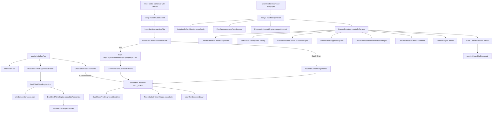

# Call Graph Diagram — Function & Method Invocation Hierarchy

```mermaid
graph TD
    AppInit[app.js: initializeApp] --> StoreInit[StateStore.init]
    AppInit --> TimeInit[DualClockTimeEngine.startTicker]
    AppInit --> UrlInit[UrlStateService.deserialize]
    
    UrlInit -->|If Hash Present| StoreDispatch[StateStore.dispatch: SET_STATE]
    
    UserAction[User Clicks Generate with Gemini] --> HandleSubmit[app.js: handleGoalSubmit]
    HandleSubmit --> SanitizeInput[InputSanitizer.sanitizeTitle]
    SanitizeInput --> GeminiInvoke[GeminiAiClient.decomposeGoal]
    
    GeminiInvoke -->|Try| FetchAPI[fetch https://generativelanguage.googleapis.com]
    GeminiInvoke -->|Catch Error| FallbackInvoke[HeuristicGenerator.generate]
    
    FetchAPI --> ValidateJSON[GeminiAiClient.validateSchema]
    ValidateJSON --> StoreDispatch
    FallbackInvoke --> StoreDispatch
    
    StoreDispatch --> TimeUpdate[DualClockTimeEngine.setDeadline]
    StoreDispatch --> HistoryPush[TokenBucketHistoryGuard.pushState]
    StoreDispatch --> RenderDOM[ViewRenderer.renderAll]
    
    TimeInit --> RAFLoop[DualClockTimeEngine.tick]
    RAFLoop --> PerfNow[window.performance.now]
    RAFLoop --> CalcUnits[DualClockTimeEngine.calculateRemaining]
    CalcUnits --> UpdateTickerDOM[ViewRenderer.updateTicker]
    
    UserExport[User Clicks Download Wallpaper] --> HandleExport[app.js: handleExportClick]
    HandleExport --> AllocScale[AdaptiveBufferAllocator.solveScale]
    HandleExport --> FontCheck[FontService.ensureFontsLoaded]
    HandleExport --> LayoutCalc[ResponsiveLayoutEngine.computeLayout]
    HandleExport --> CanvasAlloc[CanvasRenderer.renderToCanvas]
    CanvasAlloc --> DrawBase[CanvasRenderer.drawBackground]
    CanvasAlloc --> DrawSafe[SafeZoneOverlay.drawOverlay]
    CanvasAlloc --> DrawDigits[CanvasRenderer.drawCountdownDigits]
    CanvasAlloc --> WrapText[CanvasTextWrapper.wrapText]
    CanvasAlloc --> DrawSteps[CanvasRenderer.drawMilestoneBadges]
    CanvasAlloc --> DrawQuote[CanvasRenderer.drawAffirmation]
    CanvasAlloc --> ParticleBurst[ParticleEngine.render]
    CanvasAlloc --> CanvasToBlob[HTMLCanvasElement.toBlob]
    CanvasToBlob --> DownloadTrigger[app.js: triggerFileDownload]
```
