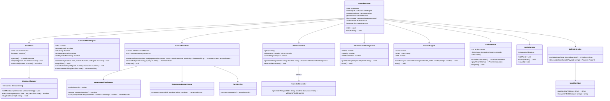

# Class Diagram — Object-Oriented Architecture & Contracts

```mermaid
classDiagram
    class CountdownApp {
        -store: StateStore
        -timeEngine: DualClockTimeEngine
        -canvasRenderer: CanvasRenderer
        -geminiClient: GeminiAiClient
        -historyGuard: TokenBucketHistoryGuard
        -audioService: AudioService
        -hapticService: HapticService
        +init(): void
        +bindEvents(): void
    }

    class StateStore {
        -state: CountdownState
        -listeners: Function[]
        +getState(): CountdownState
        +dispatch(action: CountdownAction): void
        +subscribe(listener: Function): Function
    }

    class DualClockTimeEngine {
        -rafId: number
        -lastWallEpoch: number
        -isRunning: boolean
        -activeTargetEpoch: number
        -lastReportedRemaining: number
        +startTicker(deadline: Date, onTick: Function, onExpire: Function): void
        +stopTicker(): void
        +reanchorClocks(wallEpoch: number, monoTime: number): void
        +calculateRemaining(deadline: Date): TimeRemaining
    }

    class MilestoneManager {
        -milestones: MilestoneItem[]
        +setMilestones(milestones: MilestoneItem[]): void
        +calculateProgress(startTime: Date, deadline: Date): number
        +toggleMilestone(id: string): void
    }

    class GeminiAiClient {
        -apiKey: string
        -activeAbortController: AbortController
        -currentRequestEpoch: number
        +generatePlan(goalTitle: string, deadline: Date): Promise~MilestonePlanResponse~
        +abortActiveRequest(): void
    }

    class HeuristicGenerator {
        +generatePlan(goalTitle: string, deadline: Date, now: Date): MilestonePlanResponse
    }

    class AdaptiveBufferAllocator {
        -cachedMaxDim: number
        +getMaxTextureDimension(): number
        +computeOptimalBuffer(baseWidth: number, baseHeight: number): BufferBounds
    }

    class ResponsiveLayoutEngine {
        +computeLayout(width: number, height: number): ComputedLayout
    }

    class InputSanitizer {
        +sanitizeGoalTitle(raw: string): string
        +escapeXmlEntities(input: string): string
    }

    class UrlStateService {
        +serializeState(state: CountdownState): Promise~string~
        +deserializeState(base64Payload: string): Promise~Record~
    }

    class TokenBucketHistoryGuard {
        -tokens: number
        -capacity: number
        -refillRatePerSec: number
        +pushStateUpdate(hashPayload: string): void
        +flush(): void
    }

    class ParticleEngine {
        -count: number
        -buffer: Float32Array
        -rafId: number
        +startBurst(ctx: CanvasRenderingContext2D, width: number, height: number): void
        +stop(): void
    }

    class AudioService {
        -ctx: AudioContext
        -limiterNode: DynamicsCompressorNode
        -state: string
        +unlockAudioContext(): Promise~boolean~
        +playVictoryChime(): Promise~boolean~
        +dispose(): void
    }

    class HapticService {
        -isSupported: boolean
        +lightTap(): void
        +victoryPattern(): void
        +cancel(): void
    }

    class FontService {
        +ensureFontsReady(): Promise~void~
    }

    class CanvasRenderer {
        -canvas: HTMLCanvasElement
        -ctx: CanvasRenderingContext2D
        +renderWallpaper(options: WallpaperRenderOptions, state: CountdownState, remaining: TimeRemaining): Promise~HTMLCanvasElement~
        +exportBlob(format: string, quality: number): Promise~Blob~
        +dispose(): void
    }

    CountdownApp --> StateStore
    CountdownApp --> DualClockTimeEngine
    CountdownApp --> CanvasRenderer
    CountdownApp --> GeminiAiClient
    CountdownApp --> UrlStateService
    CountdownApp --> TokenBucketHistoryGuard
    CountdownApp --> AudioService
    CountdownApp --> HapticService
    CountdownApp --> ParticleEngine
    StateStore --> MilestoneManager
    GeminiAiClient ..> HeuristicGenerator : fallback
    CanvasRenderer --> AdaptiveBufferAllocator
    CanvasRenderer --> ResponsiveLayoutEngine
    CanvasRenderer --> FontService
    UrlStateService --> InputSanitizer
```
