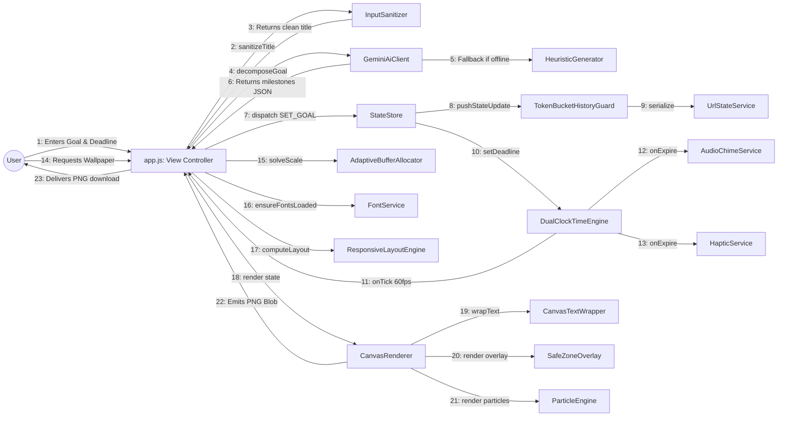

# Communication Diagram — Inter-Module Collaboration

```mermaid
graph LR
    User((User)) -->|1: Enters Goal & Deadline| UI[app.js: View Controller]
    UI -->|2: sanitizeTitle| San[InputSanitizer]
    San -->|3: Returns clean title| UI
    UI -->|4: decomposeGoal| Gemini[GeminiAiClient]
    Gemini -->|5: Fallback if offline| Heuristic[HeuristicGenerator]
    Gemini -->|6: Returns milestones JSON| UI
    UI -->|7: dispatch SET_GOAL| Store[StateStore]
    Store -->|8: pushStateUpdate| Guard[TokenBucketHistoryGuard]
    Guard -->|9: serialize| URLCodec[UrlStateService]
    Store -->|10: setDeadline| Engine[DualClockTimeEngine]
    Engine -->|11: onTick 60fps| UI
    Engine -->|12: onExpire| Audio[AudioChimeService]
    Engine -->|13: onExpire| Haptic[HapticService]
    User -->|14: Requests Wallpaper| UI
    UI -->|15: solveScale| Alloc[AdaptiveBufferAllocator]
    UI -->|16: ensureFontsLoaded| Fonts[FontService]
    UI -->|17: computeLayout| Layout[ResponsiveLayoutEngine]
    UI -->|18: render state| Canvas[CanvasRenderer]
    Canvas -->|19: wrapText| Wrap[CanvasTextWrapper]
    Canvas -->|20: render overlay| Safe[SafeZoneOverlay]
    Canvas -->|21: render particles| Particles[ParticleEngine]
    Canvas -->|22: Emits PNG Blob| UI
    UI -->|23: Delivers PNG download| User
```
