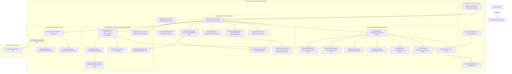

# Component Diagram — System Components & External Boundaries

```mermaid
graph TD
    Client[Browser Client] -->|HTTP GET /| CDN[GitHub Pages Fastly CDN]

    subgraph PWARuntime [Countdown Lock Screen PWA Container]
        subgraph PresentationLayer [Presentation & Interaction Layer]
            UIView[Responsive DOM UI & Glassmorphism Styles]
            Simulator[Lock Screen Ergonomics Overlay Simulator]
            SaveModal[Press & Hold Standalone PWA Modal]
        end

        subgraph CoreEngineLayer [Core Logic & Chronometry Layer]
            StateStore[StateStore: Unidirectional Store & Trampoline Queue]
            TimeEng[DualClockTimeEngine: Drift-Compensated RAF Ticker]
            UrlCodec[UrlStateService: Base64 URL Hash Codec]
            HistoryGuard[TokenBucketHistoryGuard: 300ms Leaky Bucket]
            Sanitizer[InputSanitizer: Unicode NFKC & Whitelist Pipeline]
            MilestoneMgr[MilestoneManager: Backward Planning Tracker]
            StorageSvc[ResilientStorageService: 4-Tier IndexedDB & LocalStorage Adapter]
            Lifecycle[LifecycleScope: RAII Scope & Listener Guard]
            Ports[Clean Architecture Abstract Ports: ITickScheduler, IMilestonePlanner, etc.]
        end

        subgraph RenderingLayer [High-DPI Wallpaper Rendering Engine]
            CanvasEng[CanvasRenderer: 1170x2532 2D Offscreen Pipeline]
            Alloc[AdaptiveBufferAllocator: Dynamic Hardware Scale Solver]
            LayoutEng[ResponsiveLayoutEngine: Tri-Modal Aspect Ratio Solver]
            FontSvc[FontService: Web Font FontFace Set Preloader]
            TextWrapper[CanvasTextWrapper: Greedy Wrap & Font Fit]
            ParticleEng[ParticleEngine: Float32Array Confetti Physics]
            SafeOverlay[SafeZoneOverlay: Biomechanical Occlusion Guides]
            BlobGen[Blob Exporter & Image Streamer]
        end

        subgraph SensoryLayer [Audio, Haptics & Background Worker Subsystems]
            SensoryCoord[SensoryCoordinator: Tri-Modal Sensory Synchronization Coordinator]
            AudioChime[AudioChimeService: Procedural Web Audio API]
            HapticCtrl[HapticService: Vibration API Feedback]
            WorkerTicker[WorkerTickerAdapter: 1Hz Background Worker Ticker]
            WebLocks[WebLocksMutex: Navigator Web Locks Single-Instance Mutex]
            SyncChannel[BroadcastChannel: Same-Origin Multi-Tab State Bus]
        end

        subgraph AILayer [Google Gemini Intelligence Layer]
            GeminiSDK[GeminiAiClient: Gemini 3.8 Flash Client]
            RateLimiter[GeminiRateLimiter: 15 RPM Token Bucket Guard]
            FallbackGen[HeuristicGenerator: Retrograde Sprints Fallback]
        end
    end

    subgraph ExternalCloud [External Third-Party APIs]
        GoogleGeminiAPI[Google Gemini AI REST API]
    end

    UIView --> Sanitizer
    Sanitizer --> HistoryGuard
    HistoryGuard --> UrlCodec
    UIView --> StateStore
    Simulator --> SafeOverlay
    StateStore --> MilestoneMgr
    StateStore --> TimeEng
    StateStore --> UrlCodec
    StateStore --> StorageSvc
    StateStore --> Lifecycle
    StateStore --> SyncChannel
    AudioChime --> WebLocks
    StateStore --> SensoryCoord
    SensoryCoord --> AudioChime
    SensoryCoord --> HapticCtrl
    SensoryCoord --> ParticleEng
    StateStore --> CanvasEng
    TimeEng --> Ports
    TimeEng --> WorkerTicker
    CanvasEng --> Alloc
    CanvasEng --> FontSvc
    CanvasEng --> LayoutEng
    CanvasEng --> SafeOverlay
    CanvasEng --> TextWrapper
    CanvasEng --> ParticleEng
    CanvasEng --> BlobGen
    BlobGen --> SaveModal
    StateStore --> GeminiSDK
    GeminiSDK --> RateLimiter
    GeminiSDK --> FallbackGen
    GeminiSDK -->|HTTPS REST: x-goog-api-key| GoogleGeminiAPI
```
