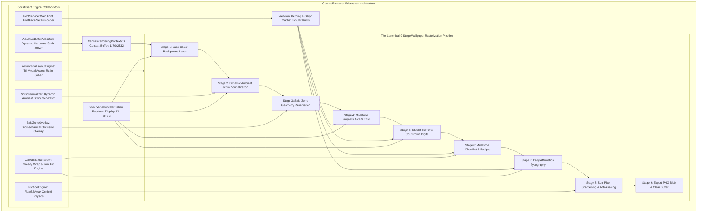

# Composite Structure Diagram — Internal Structure of Canvas Engine

```mermaid
graph TD
    subgraph CountdownCanvasEngine [CanvasRenderer Subsystem Architecture]
        CanvasContext[CanvasRenderingContext2D Context Buffer: 1170x2532]
        
        subgraph SubModules [Constituent Engine Collaborators]
            AllocMod[AdaptiveBufferAllocator: Dynamic Hardware Scale Solver]
            LayoutMod[ResponsiveLayoutEngine: Tri-Modal Aspect Ratio Solver]
            FontMod[FontService: Web Font FontFace Set Preloader]
            WrapMod[CanvasTextWrapper: Greedy Wrap & Font Fit Engine]
            OverlayMod[SafeZoneOverlay: Biomechanical Occlusion Overlay]
            ParticleMod[ParticleEngine: Float32Array Confetti Physics]
            ScrimMod[ScrimNormalizer: Dynamic Ambient Scrim Generator]
        end

        subgraph CompositionPipelines [The Canonical 9-Stage Wallpaper Rasterization Pipeline]
            Stage1[Stage 1: Base OLED Background Layer]
            Stage2[Stage 2: Dynamic Ambient Scrim Normalization]
            Stage3[Stage 3: Safe-Zone Geometry Reservation]
            Stage4[Stage 4: Milestone Progress Arcs & Ticks]
            Stage5[Stage 5: Tabular Numeral Countdown Digits]
            Stage6[Stage 6: Milestone Checklist & Badges]
            Stage7[Stage 7: Daily Affirmation Typography]
            Stage8[Stage 8: Sub-Pixel Sharpening & Anti-Aliasing]
            Stage9[Stage 9: Export PNG Blob & Clear Buffer]
        end

        FontCache[WebFont Kerning & Glyph Cache: Tabular Nums]
        ColorResolver[CSS Variable Color Token Resolver: Display P3 / sRGB]
    end

    AllocMod --> CanvasContext
    LayoutMod --> CompositionPipelines
    FontMod --> FontCache
    
    CanvasContext --> Stage1
    Stage1 --> Stage2
    Stage2 --> Stage3
    Stage3 --> Stage4
    Stage4 --> Stage5
    Stage5 --> Stage6
    Stage6 --> Stage7
    Stage7 --> Stage8
    Stage8 --> Stage9
    
    ScrimMod --> Stage2
    OverlayMod --> Stage3
    FontCache --> Stage4
    FontCache --> Stage5
    FontCache --> Stage6
    FontCache --> Stage7
    WrapMod --> Stage6
    WrapMod --> Stage7
    ParticleMod --> Stage8
    ColorResolver --> Stage1
    ColorResolver --> Stage2
    ColorResolver --> Stage4
    ColorResolver --> Stage5
```
