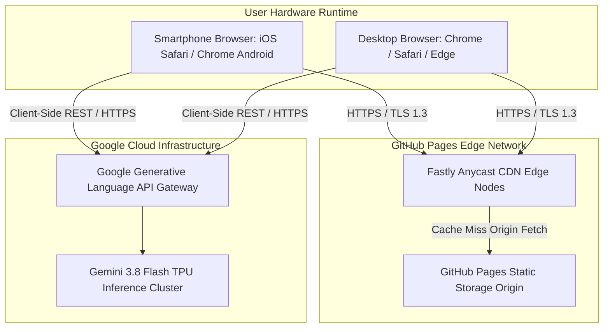

# Deployment Diagram — Runtime Infrastructure & Edge CDN

```mermaid
graph TD
    subgraph ClientEnvironment [User Hardware Runtime]
        Smartphone[Smartphone Browser: iOS Safari / Chrome Android]
        Desktop[Desktop Browser: Chrome / Safari / Edge]
    end

    subgraph EdgeCDN [GitHub Pages Edge Network]
        EdgeAnycast[Fastly Anycast CDN Edge Nodes]
        OriginStorage[GitHub Pages Static Storage Origin]
    end

    subgraph CloudAPIs [Google Cloud Infrastructure]
        GeminiGateway[Google Generative Language API Gateway]
        GeminiCluster[Gemini 3.8 Flash TPU Inference Cluster]
    end

    Smartphone -->|HTTPS / TLS 1.3| EdgeAnycast
    Desktop -->|HTTPS / TLS 1.3| EdgeAnycast
    EdgeAnycast -->|Cache Miss Origin Fetch| OriginStorage
    Smartphone -->|Client-Side REST / HTTPS| GeminiGateway
    Desktop -->|Client-Side REST / HTTPS| GeminiGateway
    GeminiGateway --> GeminiCluster
```
