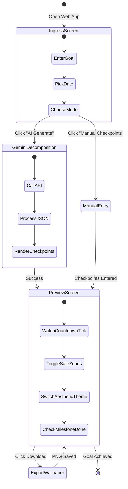

# Interaction Overview Diagram — User Workflow Orchestration

```mermaid
stateDiagram-v2
    [*] --> IngressScreen: Open Web App
    
    state IngressScreen {
        [*] --> EnterGoal
        EnterGoal --> PickDate
        PickDate --> ChooseMode
    }
    
    ChooseMode --> GeminiDecomposition: Click "AI Generate"
    ChooseMode --> ManualEntry: Click "Manual Checkpoints"
    
    state GeminiDecomposition {
        [*] --> CallAPI
        CallAPI --> ProcessJSON
        ProcessJSON --> RenderCheckpoints
    }
    
    GeminiDecomposition --> PreviewScreen: Success
    ManualEntry --> PreviewScreen: Checkpoints Entered
    
    state PreviewScreen {
        [*] --> WatchCountdownTick
        WatchCountdownTick --> ToggleSafeZones
        ToggleSafeZones --> SwitchAestheticTheme
        SwitchAestheticTheme --> CheckMilestoneDone
    }
    
    PreviewScreen --> ExportWallpaper: Click Download
    ExportWallpaper --> PreviewScreen: PNG Saved
    PreviewScreen --> [*]: Goal Achieved
```
