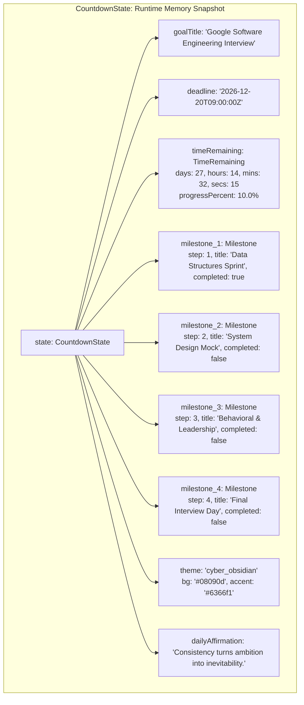

# Object Diagram — Runtime Memory State Snapshot

```mermaid
graph TD
    subgraph StateSnapshot [CountdownState: Runtime Memory Snapshot]
        AppStore["state: CountdownState"]
        Goal["goalTitle: 'Google Software Engineering Interview'"]
        Deadline["deadline: '2026-12-20T09:00:00Z'"]
        TimeObj["timeRemaining: TimeRemaining<br/>days: 27, hours: 14, mins: 32, secs: 15<br/>progressPercent: 10.0%"]
        
        M1["milestone_1: Milestone<br/>step: 1, title: 'Data Structures Sprint', completed: true"]
        M2["milestone_2: Milestone<br/>step: 2, title: 'System Design Mock', completed: false"]
        M3["milestone_3: Milestone<br/>step: 3, title: 'Behavioral & Leadership', completed: false"]
        M4["milestone_4: Milestone<br/>step: 4, title: 'Final Interview Day', completed: false"]
        
        Theme["theme: 'cyber_obsidian'<br/>bg: '#08090d', accent: '#6366f1'"]
        Affirmation["dailyAffirmation: 'Consistency turns ambition into inevitability.'"]
    end

    AppStore --> Goal
    AppStore --> Deadline
    AppStore --> TimeObj
    AppStore --> M1
    AppStore --> M2
    AppStore --> M3
    AppStore --> M4
    AppStore --> Theme
    AppStore --> Affirmation
```
