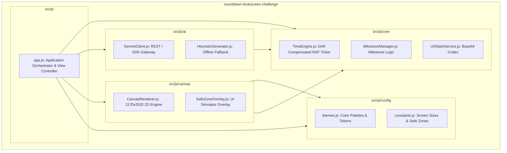

# Package Diagram — Module Layering & Namespace Boundaries

```mermaid
graph TD
    subgraph RootPackage [countdown-lockscreen-challenge]
        subgraph ConfigLayer [src/js/config]
            ThemeConfig[themes.js: Color Palettes & Tokens]
            AppConstants[constants.js: Screen Sizes & Safe Zones]
        end

        subgraph CoreLayer [src/js/core]
            TimeEnginePkg[TimeEngine.js: Drift-Compensated RAF Ticker]
            MilestonePkg[MilestoneManager.js: Milestone Logic]
            UrlStatePkg[UrlStateService.js: Base64 Codec]
        end

        subgraph AILayer [src/js/ai]
            GeminiClientPkg[GeminiClient.js: REST / SDK Gateway]
            HeuristicPkg[HeuristicGenerator.js: Offline Fallback]
        end

        subgraph CanvasLayer [src/js/canvas]
            CanvasRendererPkg[CanvasRenderer.js: 1170x2532 2D Engine]
            SafeZoneOverlayPkg[SafeZoneOverlay.js: UI Simulator Overlay]
        end

        subgraph AppEntry [src/js]
            AppBootstrap[app.js: Application Orchestrator & View Controller]
        end
    end

    AppBootstrap --> CoreLayer
    AppBootstrap --> AILayer
    AppBootstrap --> CanvasLayer
    AppBootstrap --> ConfigLayer
    
    CanvasLayer --> ConfigLayer
    CanvasLayer --> CoreLayer
    AILayer --> CoreLayer
```
