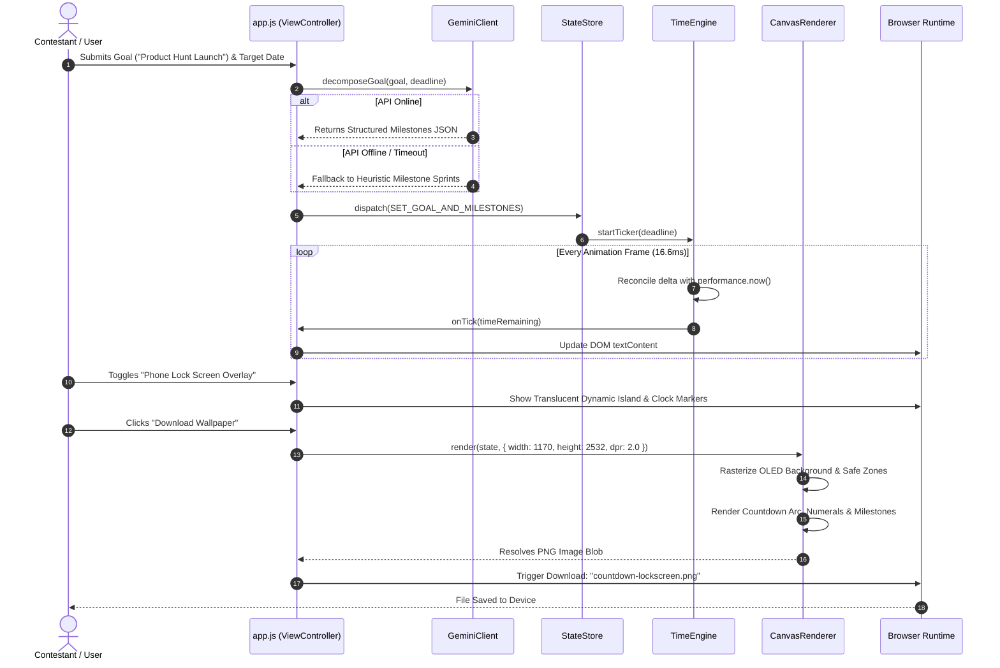

# Sequence Diagram — End-to-End System Execution

```mermaid
sequenceDiagram
    autonumber
    actor User as Contestant / User
    participant App as app.js (ViewController)
    participant Gemini as GeminiClient
    participant Store as StateStore
    participant Ticker as TimeEngine
    participant Canvas as CanvasRenderer
    participant Browser as Browser Runtime

    User->>App: Submits Goal ("Product Hunt Launch") & Target Date
    App->>Gemini: decomposeGoal(goal, deadline)
    
    alt API Online
        Gemini-->>App: Returns Structured Milestones JSON
    else API Offline / Timeout
        Gemini-->>App: Fallback to Heuristic Milestone Sprints
    end
    
    App->>Store: dispatch(SET_GOAL_AND_MILESTONES)
    Store->>Ticker: startTicker(deadline)
    
    loop Every Animation Frame (16.6ms)
        Ticker->>Ticker: Reconcile delta with performance.now()
        Ticker->>App: onTick(timeRemaining)
        App->>Browser: Update DOM textContent
    end

    User->>App: Toggles "Phone Lock Screen Overlay"
    App->>Browser: Show Translucent Dynamic Island & Clock Markers

    User->>App: Clicks "Download Wallpaper"
    App->>Canvas: render(state, { width: 1170, height: 2532, dpr: 2.0 })
    Canvas->>Canvas: Rasterize OLED Background & Safe Zones
    Canvas->>Canvas: Render Countdown Arc, Numerals & Milestones
    Canvas-->>App: Resolves PNG Image Blob
    App->>Browser: Trigger Download: "countdown-lockscreen.png"
    Browser-->>User: File Saved to Device
```
