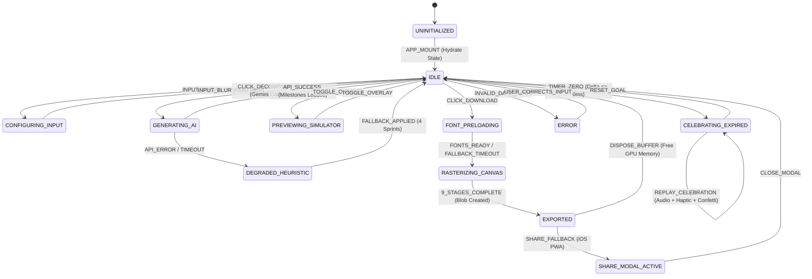

# State Diagram — Formal 12-State Finite State Machine

```mermaid
stateDiagram-v2
    [*] --> UNINITIALIZED
    UNINITIALIZED --> IDLE : APP_MOUNT (Hydrate State)

    IDLE --> CONFIGURING_INPUT : INPUT_FOCUS
    CONFIGURING_INPUT --> IDLE : INPUT_BLUR (Flush Hash)

    IDLE --> GENERATING_AI : CLICK_DECOMPOSE (Gemini Call)
    GENERATING_AI --> IDLE : API_SUCCESS (Milestones Loaded)
    GENERATING_AI --> DEGRADED_HEURISTIC : API_ERROR / TIMEOUT
    DEGRADED_HEURISTIC --> IDLE : FALLBACK_APPLIED (4 Sprints)

    IDLE --> PREVIEWING_SIMULATOR : TOGGLE_OVERLAY
    PREVIEWING_SIMULATOR --> IDLE : TOGGLE_OVERLAY

    IDLE --> FONT_PRELOADING : CLICK_DOWNLOAD
    FONT_PRELOADING --> RASTERIZING_CANVAS : FONTS_READY / FALLBACK_TIMEOUT
    RASTERIZING_CANVAS --> EXPORTED : 9_STAGES_COMPLETE (Blob Created)
    EXPORTED --> SHARE_MODAL_ACTIVE : SHARE_FALLBACK (iOS PWA)
    SHARE_MODAL_ACTIVE --> IDLE : CLOSE_MODAL
    EXPORTED --> IDLE : DISPOSE_BUFFER (Free GPU Memory)

    IDLE --> CELEBRATING_EXPIRED : TIMER_ZERO (Delta <= 0ms)
    CELEBRATING_EXPIRED --> CELEBRATING_EXPIRED : REPLAY_CELEBRATION (Audio + Haptic + Confetti)
    CELEBRATING_EXPIRED --> IDLE : RESET_GOAL

    IDLE --> ERROR : INVALID_DATE_INPUT
    ERROR --> IDLE : USER_CORRECTS_INPUT
```
