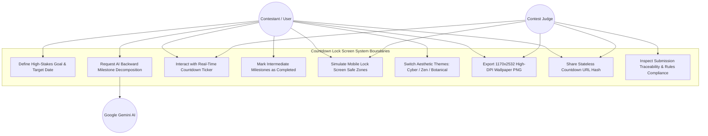

# Use Case Diagram — System Actors & Capabilities

```mermaid
graph TD
    Contestant((Contestant / User))
    Judge((Contest Judge))
    GeminiSystem((Google Gemini AI))

    subgraph SystemCapabilities [Countdown Lock Screen System Boundaries]
        UC1[Define High-Stakes Goal & Target Date]
        UC2[Request AI Backward Milestone Decomposition]
        UC3[Interact with Real-Time Countdown Ticker]
        UC4[Mark Intermediate Milestones as Completed]
        UC5[Simulate Mobile Lock Screen Safe Zones]
        UC6[Switch Aesthetic Themes: Cyber / Zen / Botanical]
        UC7[Export 1170x2532 High-DPI Wallpaper PNG]
        UC8[Share Stateless Countdown URL Hash]
        UC9[Inspect Submission Traceability & Rules Compliance]
    end

    Contestant --> UC1
    Contestant --> UC2
    Contestant --> UC3
    Contestant --> UC4
    Contestant --> UC5
    Contestant --> UC6
    Contestant --> UC7
    Contestant --> UC8

    Judge --> UC3
    Judge --> UC5
    Judge --> UC7
    Judge --> UC8
    Judge --> UC9

    UC2 --> GeminiSystem
```
